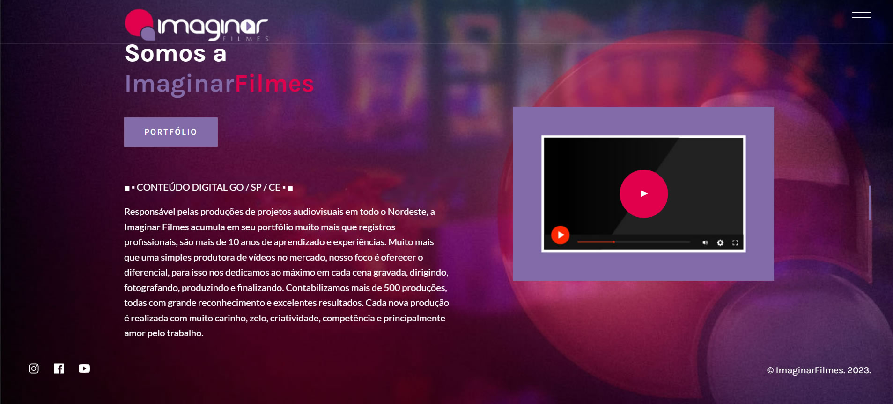
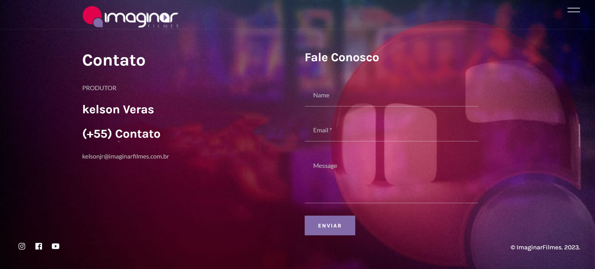

# ImaginarFilmes
Muito mais que uma simples produtora de vídeos no mercado
 
■ ▪︎ CONTEÚDO DIGITAL GO / SP / CE ▪︎ ■
 

 

  <a href="#tecnologias">Tecnologias</a> |
  <a href="#Páginas">Paginas</a>

 
<h2>QR code para ver o site completo</h2>

 

# Tecnologias

Esse projeto foi desenvolvido com as seguintes tecnologias:

# Páginas 
 

## Inicio

## Contato

 

# Responsável pelas produções de projetos audiovisuais em todo o Nordeste, a Imaginar Filmes acumula em seu portfólio muito mais que registros profissionais, são mais de 10 anos de aprendizado e experiências. Muito mais que uma simples produtora de vídeos no mercado, nosso foco é oferecer o diferencial, para isso nos dedicamos ao máximo em cada cena gravada, dirigindo, fotografando, produzindo e finalizando. Contabilizamos mais de 500 produções, todas com grande reconhecimento e excelentes resultados. Cada nova produção é realizada com muito carinho, zelo, criatividade, competência e principalmente amor pelo trabalho.
